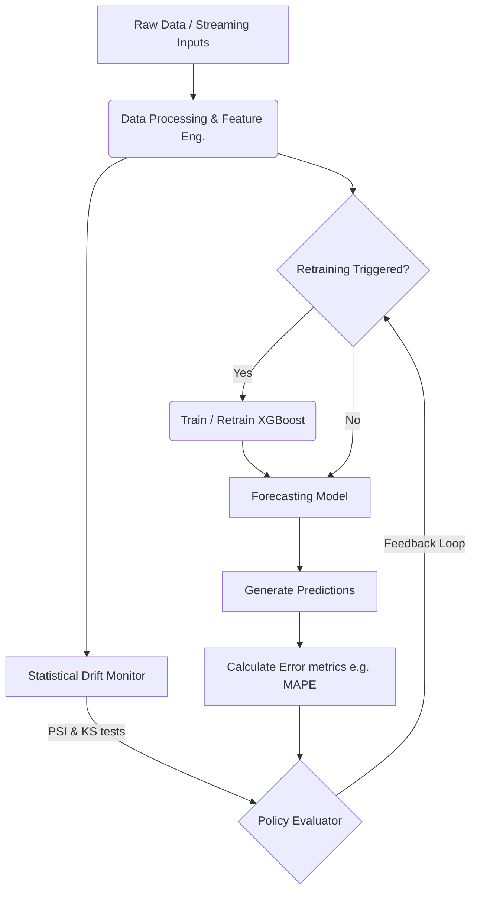
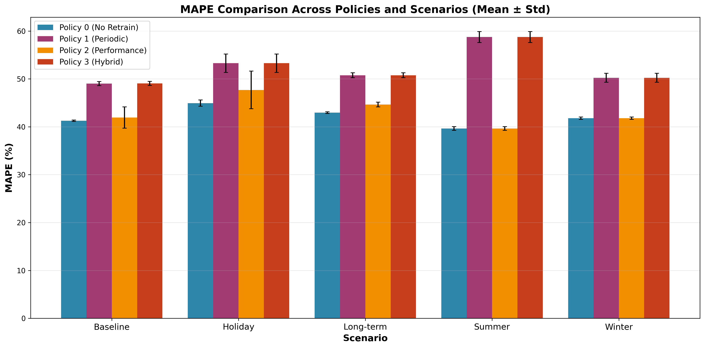
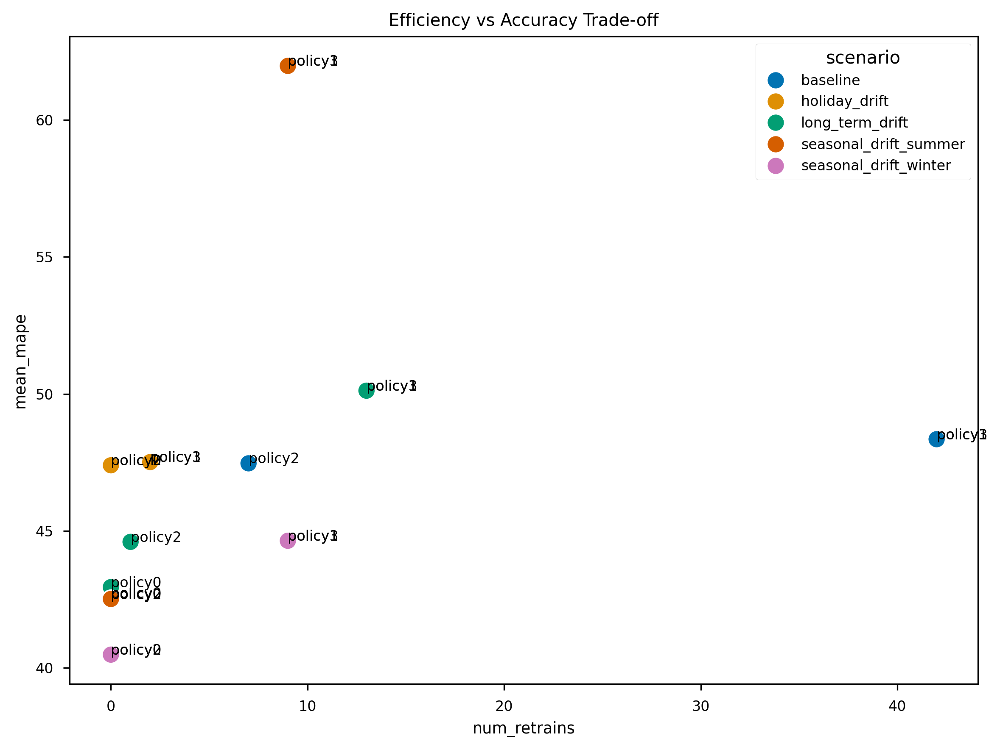

<h1 align="center">GridSentinel ⚡</h1>

<p align="center">
  <strong>Drift-Aware MLOps Pipeline for Household Load Forecasting</strong>
</p>

<p align="center">
  <a href="https://github.com/bled1908/gridsentinel-drift-aware-mlops/actions"></a>
  <a href="https://www.python.org/downloads/"></a>
  <a href="https://github.com/bled1908/gridsentinel-drift-aware-mlops/blob/main/LICENSE"></a>
  <a href="https://github.com/psf/black"></a>
</p>

---

## 📖 Overview

**GridSentinel** is an automated, end-to-end MLOps pipeline designed to continuously forecast household electricity loads while actively monitoring for and adapting to **concept drift**. Trained on the [UCI Household Power Consumption](https://archive.ics.uci.edu/ml/datasets/individual+household+electric+power+consumption) dataset, it utilizes a robust XGBoost forecasting model paired with statistical drift detection (PSI, KS-tests) and configurable model-retraining policies.

**Key Finding:** Exhaustive experiments reveal that **Policy 0 (no retraining)** achieves the highest accuracy across long-term, seasonal, and holiday drift scenarios. Competing models utilizing aggressive retraining schedules incurred higher computational costs without corresponding gains in performance, emphasizing the need to carefully tune ML feedback loops in production.

---

## ✨ Key Features

- 🔋 **Robust Forecasting:** Built around a highly tuned XGBoost model optimized for multi-horizon load forecasting.
- 📉 **Multi-Signal Drift Detection:** Computes Population Stability Index (PSI), Kolmogorov-Smirnov (KS) tests, and tracks MAPE degradation in real-time.
- 🛠️ **Policy-Based Orchestration:** Dynamically determines when and how models should be retrained based on configuration (Periodic, Performance-based, Hybrid).
- 📊 **Comprehensive Evaluation:** Ships with native synthetic drift scenario injection (holidays, seasons, macro-trends) to thoroughly stress-test models.
- ⚙️ **Reproducible Pipelines:** Fully configurable via YAML, ensuring that data splits, hyperparameters, and thresholds remain consistently traceable.

---

## 🏛️ System Architecture

GridSentinel employs a continuous monitoring sliding-window architecture. As new data arrives, predictions are generated, residual errors are evaluated, and covariates are monitored for distributional divergence.



---

## 🚀 Getting Started

### Prerequisites
- Python 3.10 or higher
- `pip` package manager

### Installation

1. Clone the repository:
   ```bash
   git clone https://github.com/bled1908/gridsentinel-drift-aware-mlops.git
   cd gridsentinel-drift-aware-mlops
   ```
2. Set up a virtual environment (recommended):
   ```bash
   python -m venv .venv
   source .venv/bin/activate  # On Windows: .venv\Scripts\activate
   ```
3. Install the dependencies:
   ```bash
   pip install -r requirements.txt
   ```

### Quickstart Example

Run the primary evaluation pipeline for a specified policy and scenario using the CLI tool:

```bash
python src/main_pipeline.py \
    --config configs/policy0_config.yaml \
    --scenario long_term_drift \
    --output results/
```

Results (metrics logs and parsed events) will be stored in the designated `--output` directory.

---

## 📂 Project Structure

```text
gridsentinel/
├── configs/                  # Retraining policy definitions (YAML)
├── data/                     # Raw UCI dataset, processed splits, weather covariates
├── models/                   # Serialized XGBoost assets (*.json, *.pkl)
├── notebooks/                # Jupyter notebooks for data exploration and visualizations
├── results/                  
│   ├── figures/              # Generated high-quality evaluation plots (PNG)
│   └── tables/               # Formatted LaTeX metric tables
├── src/                      # Core MLOps Python packages
│   ├── data_processing.py    
│   ├── drift_detection.py    
│   ├── evaluation.py         
│   ├── forecasting_model.py  
│   ├── main_pipeline.py      # Entry point orchestrator
│   └── retraining_policies.py
├── tests/                    # Unit testing suite
├── Dockerfile                # Containerization specification
├── docker-compose.yml        
├── requirements.txt          # Pinned dependency requirements
└── README.md
```

---

## 🧪 Drift Scenarios & Retraining Policies

To validate model resilience, GridSentinel generates various synthetic anomalies on the test set:

| Scenario | Description |
|:---|:---|
| `baseline` | Standard inference with stable distributions. |
| `holiday_drift` | Anomalous usage representative of public holidays (sudden bursts/drops). |
| `long_term_drift` | A slow, gradual, compounding trend shift over several months. |
| `seasonal_drift_summer` | Sudden adaptation of usage patterns reflecting summer loads. |
| `seasonal_drift_winter` | Sudden adaptation of usage patterns reflecting winter heating loads. |

**Evaluated Retraining Policies:**

| Policy | Philosophy | Trigger Condition |
|:---:|:---|:---|
| **0** | baseline | Model is purely static. *Never retrained.* |
| **1** | Periodic | Blindly retrained on a fixed weekly schedule. |
| **2** | Performance | Retrained immediately when MAPE crosses predefined safety threshold. |
| **3** | Hybrid | Retrained on early statistical data drift (PSI) *or* lagging performance drop. |

---

## 📈 Evaluation & Results

Extensive testing across seeds indicates the static **Policy 0** consistently outperformed adaptive strategies globally regarding prediction accuracy, avoiding the phenomenon of "catastrophic forgetting" on noisy short-term drifts.

### Global MAPE Comparison

<p align="center">
  
</p>

### The Accuracy/Cost Trade-off

Adding retraining cycles did not necessarily decrease MAPE. In policies like 1 and 3, computational effort dramatically spiked without providing forecasting uplift. 

<p align="center">
  
</p>

### Comprehensive Metrics (Sample)

*Aggregated results from `results/tables/performance_table.tex`.*

| Policy | Scenario | Mean MAPE (%) | Std Dev | Retrains | Compute Time (s) |
|:---|:---|:---:|:---:|:---:|:---:|
| **Policy 0** | Baseline | **42.56** | 5.38 | 0 | 0.00 |
| Policy 2 | Baseline | 47.47 | 12.94 | 7 | 0.85 |
| **Policy 0** | Holiday Drift | **47.40** | 13.25 | 0 | 0.00 |
| **Policy 0** | Winter Drift | **40.48** | 7.05 | 0 | 0.00 |
| Policy 1 | Summer Drift | 61.97 | 28.22 | 9 | 1.06 |

---

## ⚙️ Configuration

Control GridSentinel's behavior via modular YAML configs:

```yaml
# configs/policy0_config.yaml
model:
  hyperparameters:
    n_estimators: 200
    learning_rate: 0.05
    max_depth: 4
drift:
  psi_threshold: 0.25
  features_to_monitor: ['load_lag_24h', 'load_lag_168h']
policy:
  name: 'policy0'
```

---

## 🗺️ Enterprise Roadmap
The project is actively transitioning from a research sandbox into a robust, enterprise-ready service. Future steps include:

- [ ] **API Layer Integration:** Wrapping `main_pipeline.py` in a FastAPI interface for real-time serving.
- [ ] **Hyperparameter Optimization:** Native Bayesian optimization protocols using `Optuna`.
- [ ] **Explainability Suite:** SHAP value integration to decode the XGBoost prediction process.
- [ ] **Observability:** Centralized dashboarding hooked into `logger.py` and structured JSON logs.
- [ ] **Advanced CI/CD:** Complete the GitHub actions suite for deployment and validation upon feature merge.

---

## 🤝 Contributing

Contributions are heavily encouraged! Please follow these steps:
1. Fork the repository.
2. Create your feature branch (`git checkout -b feature/AmazingFeature`).
3. Commit your changes (`git commit -m 'Add some AmazingFeature'`).
4. Push to the branch (`git push origin feature/AmazingFeature`).
5. Open a Pull Request.

---

## 📝 License

Distributed under the MIT License. See `LICENSE` for more information.
